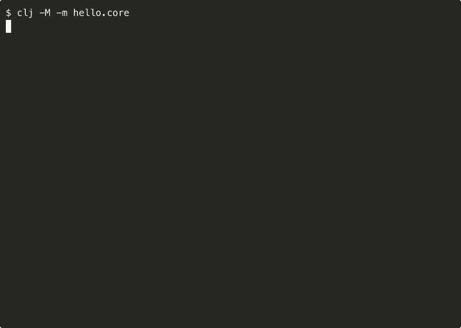

# Hello World

A minimal Clojure CLI application that prints "Hello, World!" — built as a learning exercise to explore Clojure fundamentals, testing, CI/CD, and containerization.

## Demo



## Prerequisites

- Java 21+
- [Clojure CLI](https://clojure.org/guides/install_clojure)
- Docker (optional, for containerized runs)

## Quick Start

```bash
# Run the app
make run

# Run with a custom greeting
make run NAME=Clojure

# Run tests (example-based + generative)
make test
```

## Docker

The Docker image uses a three-stage build: Clojure uberjar compilation, GraalVM native-image compilation, then a `scratch` runtime with just the static binary (~5MB total).

```bash
# Build the image
make docker-build

# Run in a container
make docker-run

# Pass a name argument
docker run --rm hello-world "Docker"
```

## Project Structure

```
hello-world/
├── deps.edn                # Dependencies and aliases
├── build.clj               # Uberjar build script (tools.build)
├── Makefile                 # Developer convenience targets
├── src/hello/
│   ├── core.clj            # Entry point (-main)
│   ├── system.clj          # Lifecycle protocol and system map
│   └── component/
│       └── greeter.clj     # Greeter component
├── test/hello/
│   ├── test_runner.clj     # Test runner
│   ├── core_test.clj       # Integration tests
│   └── component/
│       └── greeter_test.clj # Unit + generative tests
├── Dockerfile              # GraalVM native-image build (~5MB image)
└── .github/workflows/
    └── ci.yml              # GitHub Actions CI
```

## Architecture

This project follows Stuart Sierra's [Component](https://github.com/stuartsierra/component) structural pattern, implemented with plain Clojure (no external library):

- **Lifecycle protocol** (`start`/`stop`) in `hello.system`
- **Components** as defrecords under `hello.component.*`
- **System map** wires components with explicit dependency order

## Available Make Targets

```
$ make help
  help            Show this help
  run             Run the app (use NAME= for a custom greeting)
  test            Run all tests (example-based and generative)
  clean           Remove build caches
  docker-build    Build the Docker image
  docker-run      Run the app in Docker
```

## Design Principles

- **Simplicity first** — prefer the simplest solution that works
- **Zero external deps** — only Clojure core and standard JVM tooling
- **Component pattern** — explicit lifecycle and dependency wiring with plain Clojure
- **Learn by doing** — each phase introduces one new concept
- **Reproducible builds** — clone, build, test, run with standard tools
